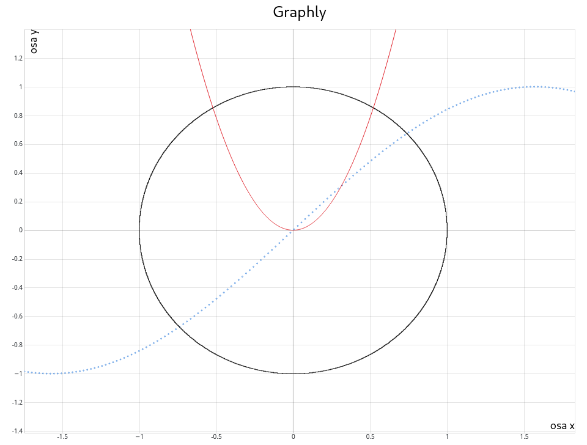
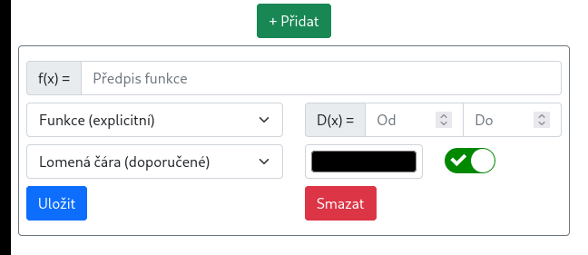
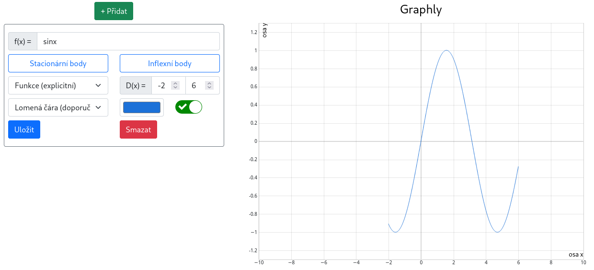

# Graphly

## Obsah

1. [Úvod](#vod)
2. [Instalace](#instalace)
3. [Built With](#built-with)
4. [Authors](#authors)
5. [License](#license)

## Úvod

**Graphly** je aplikace na vykreslování grafů funkcí - explicitně i implicitně zadaných. Uživatel si může nastavit styl,
definiční obor, barvu grafu a další. Aplikace se hodí uživatelům, kteří potřebují zjistit průběh funkce a nechtějí nebo
ji nezvládnout nakreslit sami. Graphly také umožňuje vyžít zkráceného zápisu matematických funkcí (tj. např `sin(x)` i
pouze `sinx`) a zderivování předpisu.

## Instalace

Ukázková instalace je spuštěná na adrese: [https://maturita-teal.vercel.app/](https://maturita-teal.vercel.app/). \
Aplikace je také možné si stáhnou a naistalovat přímo do vašeho počítače. Zvolte poslední vydání aplikace
ze [seznamu vydaných verzí](https://github.com/maxa-ondrej/graphly/releases) a vyberte si váším operačním systémem
podporovanou verzi. Více informací ohledně instalace naleznete právě tam.

## Ovládání programu

### Přidání první funkce

Při spuštění aplikace se na levé straně obrazovky otevře formulář, ve kterém můžete upravit nastavení předpisu grafu.

- **Předpis funkce** - zde zadejte předpis vaší funkce. využít můžete jakoukoli proměnnou, ale doporučujeme použít `x`
- **Typ zadaní** - na výběř máte ze dvou možností - explicitní a implicitní
- **Definiční obor** udává mezi kterými hodnotami na ose x bude funkce existovat
- **Typ grafu** - můžete si vybrat z lomené čáry (vykreslení bodů a spojeným úseškami), intervalovými obdélníky (
  intervali mezi body jsou zaplněny obdélníky) a tečkami u kterých si také můžete zvolit jejich množství.
- **Barva** - barva, kterou je graf vykraslen
- **Zobrazit graf** - posunovátko, jesli má být graf zobrazen nebo skryt.

Po nastavení zamýšlených hodnot, klikněte na tlačítko `Uložit`.

### Přidání další funkce

Klikněte na tlačítko `+ Přidat` a postupujte jako v předešlém kroku.

### Odebrání funkce

Pokud se nenacházíte v nastavení konkrétní funkce, klikněte na její předpis - otevře se vám zase nastavení. Pro odebrání
funkce klikněte na tlačítko `Smazat`.

### Stacionární a inflexní body

Aplikace nabízí výpočet stacionárních a inflexních bodů. Pro zobrazení jejich řešení stačí kliknout na odpovídající
tlačítko (viz obrázek). Aplikace funkci zderivuje a otevře výslednou rovnici ve Wolframu Alpha.

### Další funkce

Program umožnuje posouvání a přibližování a oddalování, pro lepší práci s grafem, zároveň vám ale na začátku nabídne
nejzajímavější část grafu.

### Seznam povolených operací

**Binární operátory**: `+`, `-`, `*`, `/`, `^`

**Funkce**:

- **sqrt:** odmocnina
- **ln:** přirozený logaritmus
- **log:** desítkový logaritmus
- **sin:** sinus
- **sinh:** hyperbolický sinus
- **asin, arcsin:** arcus sinus
- **cos, cosin:** kosinus
- **cosh, cosinh:** hyperbolický kosinus
- **acos, acosin, arccos, arccosin:** arcus kosinus
- **tan, tg:** tangens
- **tanh, tgh:** hyperbolický tangens
- **atan, atg, arctan, arctg:** arcus tangens
- **cotan, cotg:** kotangens
- **cotanh, cotgh:** hyperbolický kotangens
- **acotan, acotg, arccotan, arccotg:** arcus kotangens

**Kostanty**:

- **e, euler:** e
- **pi:** pi

## Vývojářská dokumentace

### Instalace

Pro instalaci na svém počítači je nutné je v ním mít nainstalované :

* [nodejs](https://nodejs.org/en/)
* [npm](https://www.npmjs.com/)
* [yarn](https://yarnpkg.com/)

### Spuštění

Spuštění je možné pomocí příkazů `yarn --frozen-lockfile` a `yarn start`.

### Vývoj

Systematizace adresářů a souborů:

* **public** - složka s veřejnými soubory - html template, logo
* **src** - zdrojové soubory
    * **index.tsx** - entry point aplikace
    * **App.tsx** - hlavní třída aplikace
    * **components** - užitečné komponenty bez společného záměru
    * **input** - komponetny starající se o získání zadání
    * **math**
        * **eval** - třídy starající se o tokenizaci/lexovaní a parsovaní zadání
        * **node** - databáze dostupných Nodů
        * **plot** - komponenty starající se o vykreslování grafu
    * **utils** - pomocné třídy

## Zdroje a použitý software
  - [React](https://reactjs.org/)
  - [Redux](https://redux.js.org/)
  - [React Bootstrap](https://react-bootstrap.netlify.app/)
  - [Function Plotter](https://mauriciopoppe.github.io/function-plot/)
  - [MathJS](https://mathjs.org/)
  - [TypeDoc](https://typedoc.org/)
  - [Ikona](https://www.pngwing.com/en/free-png-pwrrp)